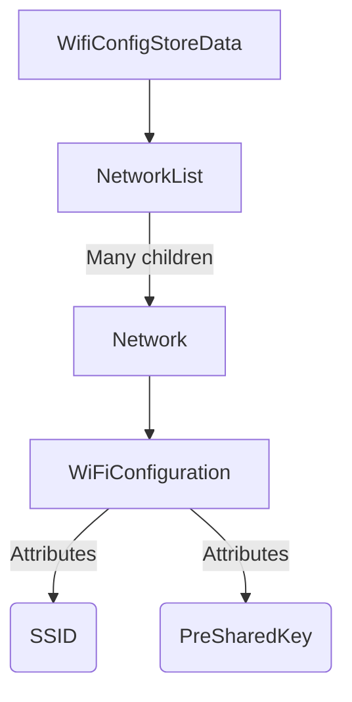

# Python program to restore my WiFi networks
I recently got a new phone and have been loving it so far. I wanted an amoled screen, stereo speakers and 120Hz screen refresh rate since most of what I do on my phone is watching videos.

I use Android because I like playing around with my phone by rooting it and installing custom ROMs and whatever. Every time I switched roms it was like getting a new phone so I had to do all the configurations from the beginning, but I liked that all my WiFi networks transfered automatically using the google backup.

Or so I thought, because when I did the same process for my new phone none of my networks transfered, and this is quite an issue for me because I have over 700 saved networks and I didn't want to lose them.

An option was to use the feature that allows to share wifi networks using QR codes, but my old phone gets really slow when accessing my saved networks, so it would take too long.

Copying the file where the networks are stored from the old to the new phone wasn't an option either, since I would have to root my new phone (which I only want to do when my phone is at least one year old) and even then many people reported that it didn't work.

So my idea was to write a Python program to read my saved wifi networks and generate the QR codes for them, so I can then scan them with my new phone and get back my networks.

## Getting the file with the networks
Many places online state that the wifi networks are saved in the `wpa_supplicant.conf` file, but I belive that since Android 9 this isn't the case anymore. They are now stored in the `WiFiConfigStore.xml` file. The location may vary from device to device, but I found mine in `/data/misc/apexdata/com.android.wifi/WifiConfigStore.xml`.

Now I want to get this file on my computer. My first idea was to use ADB to pull the file, but as the image below shows, this failed because of a lack of permissions.


Even though my phone is rooted, the adbd service doesn't have the privileges, and the `adb root` command doesn't work because of a secure configuration, so I had to copy the file from the protected directory to a directory that the `adb pull` command could access.

The command below was run in termux with root permissions.

```sh
cp /data/misc/apexdata/com.android.wifi/WifiConfigStore.xml /storage/self/primary/WifiConfigStore.xml
```

With the file now in an accessible location, we can pull it and have it in the computer for our program to use it.


## Generate the QR codes
I searched around the internet to find a program that took the `WifiConfigStore.xml` file as input and produced the QR codes as output, but I couldn't find any program that did what I wanted.

I decided to use Python because its my favorite programming language and because the least code I write the better. I quickly found the [qrcode library](https://pypi.org/project/qrcode/) and it seemed to be perfect for what I needed.

The first thing to do was to test the library to see if it could work to create the QR codes that allow the scanning device to connect to a network

First we install the QR code library and pillow to generate the images.


And use the sample code provided by the library to check that it works.


Alright, it seems to work just fine. Now lets to make a QR code to conenct to a WiFi network. We need to know the format for the QR code to connect to a wifi network. According to [wikipedia](https://en.wikipedia.org/wiki/QR_code):


The format is:

```
WIFI:S:<SSID>;T:<WEP|WPA|blank>;P:<PASSWORD>;H:<true|false|blank>;;
```

Changing the program to create a string with that format, we get the following QR code.


And when we scan it, we get connected to the network.


Nice! Now we can generate QR codes that when scanned allow us to connect to a WiFi network. Now time for the hard part.


## Extracting the networks from the file
First we had to analyze the XML file to figure out the structure of the file and where our interesting data (SSID and password) is stored. Quickly we find that the root is called `WifiConfigStoreData`, it has a child named `NetworkList` who has many children named `Network` and in the Network element there is the `WiFiConfiguration` which under `string` element has the SSID with the attribute `name` and another element with the password attribute `PreSharedKey`



For networks with a password, the PreSharedKey element is a string and the text is the password, while for open networks the element is a boolean.

For open networks we checked the correct syntax by scanning an existing open network QR code, which gave:

```
WIFI:S:*CarrouselDuLouvre_FreeWifi;T:nopass;P:;H:false;;
```

The difference is that for the Type we have to write no pass and the password is empty.

With all these information, we can move on to writing the code to extract the networks from the XML. The final code looks like:

```python
import xml.etree.ElementTree as ET

def extractNetwork(file_path):
    tree = ET.parse(file_path)
    root = tree.getroot()
    networks = []

    for wificonfig in root.iter('WifiConfiguration'):
        # Clear the variables
        ssid = None
        password = None

        for string in wificonfig.findall('string'):

            # Get SSID
            if string.attrib['name'] == 'SSID':
                ssid = string.text
                # Remove the quotes
                ssid = ssid[1:-1]

            # Get Password
            if string.attrib['name'] == 'PreSharedKey':
                password = string.text
                # Remove the quotes
                password = password[1:-1]


        # Check if it is an open network
        if password == None:
            # Open network
            # Add to dictionary
            # SSID, PASSWORD, ENCRYPTION
            networks.append([ssid, "", "nopass"])

        else:
            # Closed network
            # Add to dictionary
            # SSID, PASSWORD, ENCRYPTION
            networks.append([ssid, password, "WPA"])

    return networks
```

First we get the XML file as an argument and get the root of the element tree, and we also prepare an empty list called `networks` which will be our final result (this will be a list of lists, each sub-list being the SSID, password, and encryption type).
The iter() function allows us to find all the elements named `WifiConfiguration` and loop for each of them using the `wificonfig` variable. Then we use another for each to find all the `string` elements, and the ones whose atributes equal either "SSID" or "PreSharedKey" are stored in their corresponding variables, and stripped of the quotes that the XML has. The benefit of searching for all the `string` elements is that, in the case of an open network with no password, the element is a `boolean` and won't be picked up by our program, thus keeping the `password` variable as `None`.
Then we check if it is an open network is `password` still is `None`, and we append the list with the network to our list of networks.
Once we finish with all networks, we return the list of all networks.

## A very interesting error
I ran the program after joining all the functions expecting it to work, but moreso expecting an error and having it work at the third attempt. However, the error I got was interesting enough to warrant its own section.


If I had to guess I'd say that the issue is the "\*" in the filename. And I find this interesting because when transferring my networks to the new phone it also only transferred up until the \#en11cafe network and no further, so it is possible that is also found the same error while transferring and couldn't continue with the rest of the networks.

This doesn't explain why it worked before, but since I went from a close-to-stock rom to a MIUI rom, the MIUI implementation was probably flawed.

If we try to manually create a file with a \*, we see that it starts complaining.


And this makes a lot of sense; if I did a `ls *` I would expect it to use \* as the wildcard that it is and not an specific file or directory.

I didn't want to spend time fixing an issue that happened only for one network, so I just added that network manually.

## Final execution 
After that little issue all my QR codes generated successfully, all that was left was the laborious task of scanning them (If I spent 2 seconds per QR code, it would take me over two hours of just scanning QR codes).


## Conclusions
It was pretty fun to do this project, specially since I was very motivated because I didn't want to lose all my networks.

I'll probably have to set up a slideshow with all the QR codes and set my phone on a stand so I don't have to do it manually, but the hard part is done.

You can find the code to this program in my [GitHub](https://github.com/otelo2/WifiConfigStoreToQR) if you want to use it or tweak it. I understand that my use case is very specific but still. Just remember that the phone where the `WiFiConfigStore.xml` file comes from must be rooted.